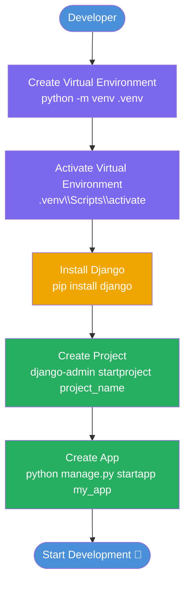

# Django Project Initial Setup Guide

> Get a Django project running from scratch — virtual environment, project creation, and app setup.

---

## Table of Contents

1. [Setup a Virtual Environment](#1-setup-a-virtual-environment)
2. [Setup a Django Project](#2-setup-a-django-project)
3. [Project vs App](#3-project-vs-app)
4. [Project Folder Structure](#4-project-folder-structure)
5. [Setup Flow](#5-setup-flow)
6. [Quick Setup Summary](#6-quick-setup-summary)

---

## 1. Setup a Virtual Environment

A virtual environment keeps your project's dependencies isolated from your system Python. This prevents version conflicts between projects.

> 📌 **Note:** Python's `venv` module is built-in — no installation required. [Official docs →](https://docs.python.org/3/library/venv.html)

**Step 1 — Create the virtual environment:**

```bash
python -m venv .venv
```

This creates a `.venv/` folder in your project directory containing an isolated Python environment.

**Step 2 — Activate it:**

```bash
# Windows
.venv\Scripts\activate

# macOS / Linux
source .venv/bin/activate
```

Once active, your terminal prompt will show `(.venv)` — all packages installed now stay scoped to this project.

> ⚠️ **Important:** Always activate your virtual environment before installing packages or running Django commands.

---

## 2. Setup a Django Project

**Step 1 — Install Django:**

```bash
pip install django
```

This installs Django inside your virtual environment only — not system-wide.

**Step 2 — Create a Django project:**

```bash
django-admin startproject project_name
```

This generates the core project scaffold — settings, URL config, and WSGI/ASGI entry points.

**Step 3 — Navigate into the project directory:**

```bash
cd project_name
```

**Step 4 — Create a Django app:**

```bash
python manage.py startapp my_app
```

> 💡 **Tip:** Run all `manage.py` commands from the directory that contains `manage.py`.

---

## 3. Project vs App

| | Django Project | Django App |
|---|---|---|
| **What it is** | The entire web application | A module handling one feature |
| **Created with** | `django-admin startproject` | `python manage.py startapp` |
| **Contains** | Settings, URLs, WSGI/ASGI config | Models, Views, Templates, URLs |
| **How many** | One per codebase | Many per project |
| **Example** | `my_blog/` | `posts/`, `users/`, `comments/` |

> 📌 **Note:** Think of the project as the container and apps as the building blocks inside it.

---

## 4. Project Folder Structure

After completing both steps, your project will look like this:

```
project_name/
│
├── manage.py                  ← CLI entry point for Django commands
│
├── project_name/              ← Core project config package
│   ├── settings.py            ← All project settings
│   ├── urls.py                ← Root URL configuration
│   ├── asgi.py                ← ASGI server entry point
│   └── wsgi.py                ← WSGI server entry point
│
└── my_app/                    ← Your first Django app
    ├── models.py              ← Database models
    ├── views.py               ← Request/response logic
    ├── admin.py               ← Admin panel config
    ├── apps.py                ← App configuration
    ├── tests.py               ← Unit tests
    └── migrations/            ← Database migration files
```

---

## 5. Setup Flow



---

## 6. Quick Setup Summary

All commands in order — copy and run sequentially:

```bash
# 1. Create and activate virtual environment
python -m venv .venv
.venv\Scripts\activate        # Windows
# source .venv/bin/activate   # macOS / Linux

# 2. Install Django
pip install django

# 3. Create project and app
django-admin startproject project_name
cd project_name
python manage.py startapp my_app

# 4. Verify setup — run the dev server
python manage.py runserver
```

> 💡 **Tip:** Visit `http://127.0.0.1:8000` in your browser after `runserver` — if you see the Django welcome page, your setup is complete.