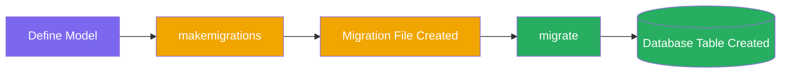
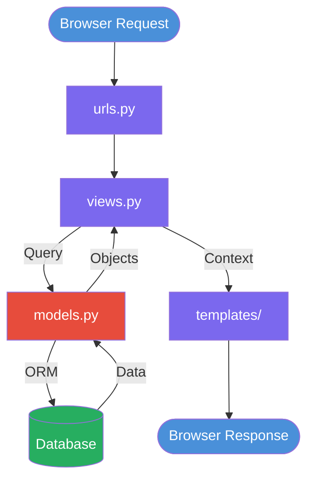

# Django Models – Complete Guide

> A practical reference for defining database structure, relationships, and queries using Django's ORM.

---

## Table of Contents

1. [Introduction](#1-introduction)
2. [Creating a Model](#2-creating-a-model)
3. [Common Field Types](#3-common-field-types)
4. [Field Options](#4-field-options)
5. [Model Relationships](#5-model-relationships)
6. [Meta Class](#6-meta-class)
7. [String Representation](#7-string-representation)
8. [Example Production Model](#8-example-production-model)
9. [After Creating Models](#9-after-creating-models)
10. [Register in Admin](#10-register-in-admin)
11. [Create a Superuser](#11-create-a-superuser)
12. [Basic Queries](#12-basic-queries)
13. [Best Practices](#13-best-practices)
14. [Models in Django Architecture](#14-models-in-django-architecture)

---

## 1. Introduction

A **Django Model** is a Python class that maps directly to a database table. Each attribute represents a column, and each instance represents a row.

```
Python Class  →  Database Table
Attribute     →  Column
Instance      →  Row
```

Django uses its ORM (Object-Relational Mapper) to translate Python operations into SQL — no raw SQL needed for standard operations.

---

## 2. Creating a Model

All models inherit from `django.db.models.Model`.

```python
from django.db import models

class Article(models.Model):
    title   = models.CharField(max_length=200)
    content = models.TextField()
    created = models.DateTimeField(auto_now_add=True)
```

> 📌 **Note:** Django automatically adds a primary key field `id` (auto-increment integer) unless you define one explicitly.

---

## 3. Common Field Types

| Field | Use Case | Key Options |
|---|---|---|
| `CharField` | Short text (name, title, slug) | `max_length` required |
| `TextField` | Long text (body, description) | No length limit |
| `IntegerField` | Whole numbers | — |
| `FloatField` | Floating point numbers | — |
| `DecimalField` | Precise decimals (prices) | `max_digits`, `decimal_places` |
| `BooleanField` | True / False | — |
| `DateField` | Date only | `auto_now`, `auto_now_add` |
| `DateTimeField` | Date + time | `auto_now`, `auto_now_add` |
| `EmailField` | Email with validation | `max_length` |
| `URLField` | URL with validation | `max_length` |
| `FileField` | File uploads | `upload_to` |
| `ImageField` | Image uploads | `upload_to` (requires Pillow) |

```python
class Product(models.Model):
    name        = models.CharField(max_length=100)
    description = models.TextField()
    price       = models.DecimalField(max_digits=10, decimal_places=2)
    in_stock    = models.BooleanField(default=True)
    created_at  = models.DateTimeField(auto_now_add=True)
    thumbnail   = models.ImageField(upload_to='products/')
```

---

## 4. Field Options

These options apply to any field type.

| Option | Type | Description |
|---|---|---|
| `null=True` | DB level | Stores `NULL` in the database |
| `blank=True` | Validation level | Allows empty value in forms |
| `default` | Any value | Sets a default if no value provided |
| `unique=True` | DB level | Enforces uniqueness across rows |
| `choices` | List of tuples | Restricts field to defined options |

```python
class Order(models.Model):

    STATUS = [
        ('pending',    'Pending'),
        ('processing', 'Processing'),
        ('shipped',    'Shipped'),
        ('delivered',  'Delivered'),
    ]

    reference = models.CharField(max_length=20, unique=True)
    status    = models.CharField(max_length=20, choices=STATUS, default='pending')
    notes     = models.TextField(null=True, blank=True)
```

> ⚠️ **Important:** `null=True` and `blank=True` are different. `null` controls the database; `blank` controls form validation. Use both together for optional fields.

---

## 5. Model Relationships

### ForeignKey — One-to-Many

Many posts belong to one author.

```python
class Post(models.Model):
    author = models.ForeignKey(
        'auth.User',
        on_delete=models.CASCADE,
        related_name='posts'
    )
    title  = models.CharField(max_length=200)
```

`on_delete` options:

| Option | Behaviour |
|---|---|
| `CASCADE` | Delete related objects |
| `SET_NULL` | Set FK to NULL (requires `null=True`) |
| `PROTECT` | Prevent deletion if related objects exist |
| `SET_DEFAULT` | Set FK to default value |

---

### ManyToManyField — Many-to-Many

A post can have many tags; a tag can belong to many posts.

```python
class Tag(models.Model):
    name = models.CharField(max_length=50)

class Post(models.Model):
    title = models.CharField(max_length=200)
    tags  = models.ManyToManyField(Tag, blank=True)
```

---

### OneToOneField — One-to-One

Extend the built-in User model with a profile.

```python
class Profile(models.Model):
    user   = models.OneToOneField('auth.User', on_delete=models.CASCADE)
    bio    = models.TextField(blank=True)
    avatar = models.ImageField(upload_to='avatars/', null=True, blank=True)
```

---

## 6. Meta Class

Control database and display behaviour via the inner `Meta` class.

```python
class Article(models.Model):
    title      = models.CharField(max_length=200)
    created_at = models.DateTimeField(auto_now_add=True)

    class Meta:
        ordering     = ['-created_at']       # newest first
        db_table     = 'articles'            # custom table name
        verbose_name = 'Article'             # singular admin label
        verbose_name_plural = 'Articles'     # plural admin label
```

| Option | Effect |
|---|---|
| `ordering` | Default query sort order |
| `db_table` | Override auto-generated table name |
| `verbose_name` | Human-readable name in admin |
| `unique_together` | Composite unique constraint |

---

## 7. String Representation

Without `__str__`, Django displays `<Article object (1)>` in the admin and shell.

```python
class Article(models.Model):
    title = models.CharField(max_length=200)

    def __str__(self):
        return self.title
```

> 💡 **Tip:** Always define `__str__` — it makes the admin panel and debugging significantly cleaner.

---

## 8. Example Production Model

```python
from django.db import models
from django.contrib.auth.models import User


class Article(models.Model):

    STATUS = [
        ('draft',     'Draft'),
        ('published', 'Published'),
        ('archived',  'Archived'),
    ]

    author     = models.ForeignKey(User, on_delete=models.CASCADE, related_name='articles')
    title      = models.CharField(max_length=255)
    slug       = models.SlugField(max_length=255, unique=True)
    content    = models.TextField()
    status     = models.CharField(max_length=20, choices=STATUS, default='draft')
    is_active  = models.BooleanField(default=True)
    created_at = models.DateTimeField(auto_now_add=True)
    updated_at = models.DateTimeField(auto_now=True)

    class Meta:
        ordering     = ['-created_at']
        verbose_name = 'Article'

    def __str__(self):
        return self.title
```

---

## 9. After Creating Models

### Step 1 — Register the app in `settings.py`

```python
INSTALLED_APPS = [
    ...
    'my_app',
]
```

### Step 2 — Generate migrations

```bash
python manage.py makemigrations
```

Creates migration files that describe the database changes.

### Step 3 — Apply migrations

```bash
python manage.py migrate
```

Executes the migration files and updates the database schema.



> ⚠️ **Important:** Run `makemigrations` every time you modify a model. Run `migrate` to apply those changes to the database.

---

## 10. Register in Admin

```python
# my_app/admin.py
from django.contrib import admin
from .models import Article

@admin.register(Article)
class ArticleAdmin(admin.ModelAdmin):
    list_display  = ['title', 'author', 'status', 'created_at']
    list_filter   = ['status']
    search_fields = ['title']
```

> 💡 **Tip:** Use `@admin.register()` decorator instead of `admin.site.register()` — it's cleaner and allows inline configuration.

---

## 11. Create a Superuser

```bash
python manage.py createsuperuser
```

Then visit `http://127.0.0.1:8000/admin` to access the admin panel.

---

## 12. Basic Queries

```python
from my_app.models import Article

# Create
article = Article.objects.create(title="Hello", content="World")

# Get single object (raises error if not found)
article = Article.objects.get(id=1)

# Filter — returns QuerySet
articles = Article.objects.filter(status='published')

# Exclude
articles = Article.objects.exclude(status='archived')

# Order
articles = Article.objects.order_by('-created_at')

# Update
Article.objects.filter(id=1).update(status='published')

# Delete
Article.objects.filter(id=1).delete()

# All records
articles = Article.objects.all()

# Count
total = Article.objects.filter(status='published').count()
```

---

## 13. Best Practices

Always include these three fields in production models:

```python
class BaseModel(models.Model):
    is_active  = models.BooleanField(default=True)
    created_at = models.DateTimeField(auto_now_add=True)
    updated_at = models.DateTimeField(auto_now=True)

    class Meta:
        abstract = True  # not created as a table — used for inheritance only
```

Inherit from it in your models:

```python
class Article(BaseModel):
    title   = models.CharField(max_length=255)
    content = models.TextField()
```

| Field | `auto_now_add` | `auto_now` |
|---|---|---|
| `created_at` | ✅ Set once on creation | ❌ |
| `updated_at` | ❌ | ✅ Updated on every save |

> 💡 **Tip:** Use `abstract = True` in `Meta` to create reusable base models. Abstract models are never migrated to the database themselves.

---

## 14. Models in Django Architecture



Models sit between your views and the database. Views query models; models handle all database interaction via the ORM.