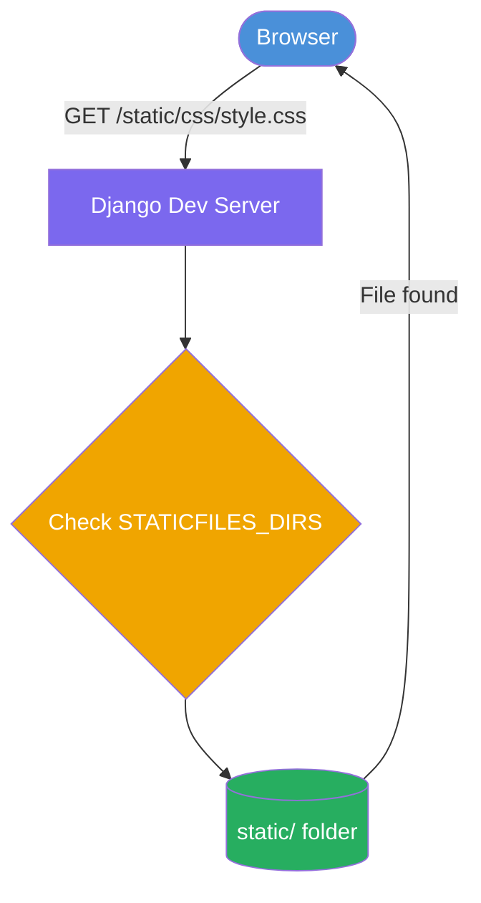
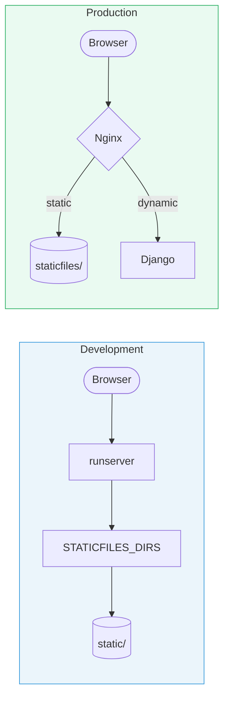

# Django Static Files Explained

> `STATIC_URL` · `STATICFILES_DIRS` · `STATIC_ROOT`

---

## Table of Contents

1. [What Are Static Files?](#1-what-are-static-files)
2. [Where Do Static Files Live?](#2-where-do-static-files-live)
3. [STATIC\_URL](#3-static_url)
4. [STATICFILES\_DIRS](#4-staticfiles_dirs)
5. [Development Flow](#5-development-flow)
6. [The Production Problem](#6-the-production-problem)
7. [STATIC\_ROOT](#7-static_root)
8. [The collectstatic Command](#8-the-collectstatic-command)
9. [Production Flow](#9-production-flow)
10. [Quick Reference](#10-quick-reference)
11. [Complete Settings Example](#11-complete-settings-example)

---

## 1. What Are Static Files?

When a browser loads a Django page, it makes separate HTTP requests for every asset the page needs.

```
GET /                          → HTML page       (Django handles)
GET /static/css/style.css      → Stylesheet
GET /static/images/logo.png    → Image
```

CSS, JavaScript, images, and fonts don't change per-request — so they're called **static files**.

---

## 2. Where Do Static Files Live?

```
project/
├── static/
│   ├── css/style.css
│   ├── js/script.js
│   └── images/logo.png
└── myapp/
    └── static/
        └── myapp/
            └── app.css        ← app-level static files
```

---

## 3. STATIC\_URL

```python
# settings.py
STATIC_URL = "/static/"
```

Tells Django: *any request starting with `/static/` is a static file request.*

```
http://127.0.0.1:8000/static/css/style.css
                      ↑
                      Django recognises this prefix
```

💡 `STATIC_URL` is a URL convention only — it says nothing about where files are stored on disk.

---

## 4. STATICFILES\_DIRS

```python
# settings.py
STATICFILES_DIRS = [
    BASE_DIR / "static",
]
```

Tells Django: *look inside these directories when searching for static files.*

```
Browser requests:   /static/css/style.css
Django strips:                 css/style.css
Django finds:       BASE_DIR/static/css/style.css  ✅
```

⚠️ This is a list — add multiple directories if needed.

---

## 5. Development Flow



During development, `runserver` serves static files automatically. No extra setup needed.

---

## 6. The Production Problem

In production, Django serving static files alongside dynamic requests creates a bottleneck:

```
Nginx   → serves CSS, JS, Images    (fast, purpose-built)
Django  → serves dynamic pages only (focused)
```

But Nginx requires all static files in **one single folder** — not scattered across multiple app directories.

---

## 7. STATIC\_ROOT

```python
# settings.py
STATIC_ROOT = BASE_DIR / "staticfiles"
```

The single directory Nginx will serve static files from. Starts empty — populated by `collectstatic`.

⚠️ Never manually add files here. Add `staticfiles/` to `.gitignore`.

---

## 8. The collectstatic Command

```bash
python manage.py collectstatic
```

Scans all static sources and copies everything into `STATIC_ROOT`.

**Before:**
```
project/
├── static/css/style.css
└── myapp/static/myapp/app.css
```

**After:**
```
project/
└── staticfiles/
    ├── css/style.css
    ├── myapp/app.css
    └── admin/...              ← Django admin assets, auto-included
```

💡 Run this as part of your deployment pipeline, not manually.

---

## 9. Production Flow


Django is completely bypassed for static file requests.

---

## 10. Quick Reference

| Setting | What It Does | Used In |
|---|---|---|
| `STATIC_URL` | URL prefix that identifies static requests | Dev + Production |
| `STATICFILES_DIRS` | Directories Django searches for static files | Development only |
| `STATIC_ROOT` | Destination folder for `collectstatic` | Production only |

---

## 11. Complete Settings Example

```python
from pathlib import Path

BASE_DIR = Path(__file__).resolve().parent.parent

STATIC_URL = "/static/"

STATICFILES_DIRS = [
    BASE_DIR / "static",        # searched during development
]

STATIC_ROOT = BASE_DIR / "staticfiles"  # populated for production
```

